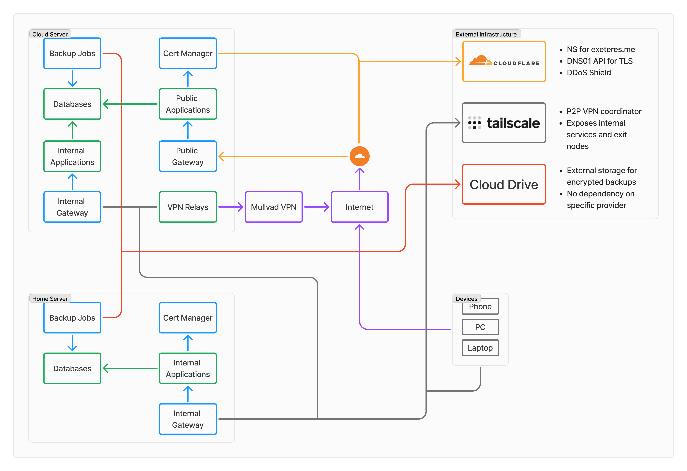

# The Home Lab Project

An ambitious attempt to make the world's best home lab using cloud technologies and Kubernetes.

## What is this?

**Private Services**

Available exclusively within the VPN formed by [Tailscale](https://tailscale.com). Connecting to one of these applications creates a direct wireguard connection between the device and the server. Certificates for such services are obtained via LetsEncrypt, so there is nothing wrong with the green padlock.

**Public Services**

Websites are available on ports 80/443, but all requests to them go through a proxy from Cloudflare, and direct requests are denied. Some applications like game servers are available for direct connection.

**Databases**.

Services that contain state, such as databases, regularly perform backups to some cloud storage. The backups themselves are encrypted and uploaded via [rclone](https://rclone.org/), so the provider is irrelevant.

**Cloud Server**

This is used to host private services that require high availability and store data encrypted on the client. Such services include vaultwarden, etebase and syncthing. In this way, a compromise between data availability and privacy is achieved. They also host public services and some game servers.

**Home Server**

This is where live all other applications that do not require high availability, store data unencrypted, or require computing resources that are cheaper to buy than to rent run. Proxmox is installed on the physical home server, and the cluster itself is created in a virtual machine - in the same way as cloud servers.

**VPN Relays**

This ridiculous name hides the technology that allows to use VPN-services blocked in Russia. Such relays are another reason why a cloud server is needed, they must be located outside the country to bypass the restrictions. VPN servers available in this way are integrated into the Tailscale network and work without conflicting with private services.

## Stack

- [Terrafom](https://www.terraform.io/) to manage the cloud resources;
- [NixOS](https://nixos.org/) as the base operating system;
- [Kubernetes](https://kubernetes.io/) as the container orchestration platform;
- [Pulumi](https://www.pulumi.com/) to manage the Kubernetes cluster and the applications running on it, as well as DNS records;
- [Cloudflare](https://www.cloudflare.com/) as the DNS provider and the proxy for the public services;
- [Tailscale](https://tailscale.com/) to form the VPN network.

## Repository Structure

- **nixos/**: The NixOS configuration files;
  - **lib/**: Some utility functions;
  - **modules/**: Shared modules for the servers and desktops;
  - **instances/**: Configuration files for specific machines;
  - **users/**: Configuration files for the users;
- **terraform/**: The Terraform configuration files;
  - **providers/**: Modules for specific providers for cloud and home servers;
  - **shared/**: Shared modules for all servers;
  - **instances/**: Configuration files for specific machines;
- **pulumi/**: The Pulumi code to manage the Kubernetes cluster and the applications running on it;
  - **packages/**: Shared packages;
  - **apps/**: Functions to create ready-to-use applications;
  - **projects/**: Pulumi projects that use the packages and apps;

## License

This repository is licensed under the MIT License.
